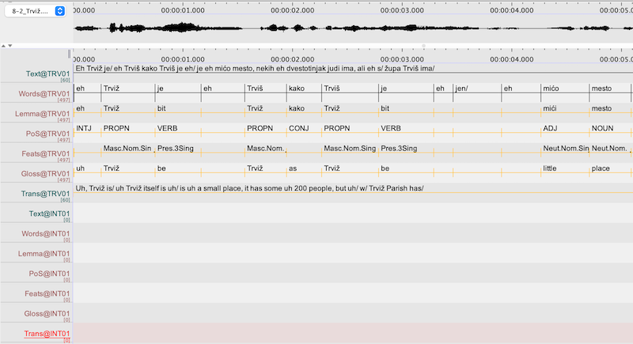

# Annotation {#annotation}

Annotators will receive an ELAN file (.eaf) containing a time-aligned transcription at the utterance and word levels, with all additional tiers already set up for the necessary annotations. ELAN files will be pre-tagged with annotations for frequent words, but these existing annotations should also be checked since homonyms may not be tagged correctly; please make sure that the annotation fits the context. Annotation instructions for the individual languages are given in the following sections.

## Using ELAN to annotate audio {#using-ELAN-annotation}

Annotators will be trained to use ELAN. It is usually most efficient to work in Interlinearization Mode (Options > Interlinearization Mode), but if you need to merge or split annotation fields, you can do this in Annotation mode (Annotation > Merge with next annotation, Merge with annotation before, Split annotation).

## Lemmatization {#lemmatization}

A lemma is the "basic" form of the word, normally the citation form that is used as the head word in dictionary entries. Lemmas should be entered in the Lemma tier for each corresponding form on the Words tier. You do not need to enter lemmas for fillers like "uh", "um" (whatever their form in the individual languages) that simply indicate hesitation and have no real meaning.

Lemmas are written using the transcription conventions for the individual variety. Proper nouns are capitalized, but other forms are in lower case. (Examples below are in italics, to set them off from the rest of the text, but in ELAN everything will be in plain text, without this formatting.)

### Čakavian {#čakavian-lemmatization}

The citation forms used as lemmas are as follows:

- for **nouns**: nominative singular. For example, the lemma for the word-form *vuci* 'wolves' is *vuk*)

- for **pronouns**: nominative singular (masculine, if the form is a pronominal modifier). For example, the lemma for *ga* 'him' (3Sing.Masc.Gen-Acc) is *on* 'he'; the lemma for *tu* 'that' (Fem.Acc.Sing) is *taj*.

- for **adjectives**: nominative singular masculine indefinite (or definite, if a distinct indefinite form is not used/does not exist). For example, the lemma for *dobre* 'good' (Fem.Gen.Sing) is *dobar*. For regular comparative and superlative forms, use the positive degree as the lemma. For (semi-)suppletive comparative/superlative forms, both the suppletive comparative degree and the positive degree should be listed. For example, the lemma for *topliji* 'warmer' is *topao*, and the lemma for *najbolji* 'best' is *dobar|bolji*.

- for **adverbs**: even though most adverbs are formed regularly from adjectives, they should be lemmatized as adverbs (e.g., *dobro* 'good', and not *dobar*)

- for **verbs**: infinitive. If the variety being transcribed normally has infinitives in *-t* or *-ć* (without the final *-i*; e.g., *kantat* 'to sing'), then this is the form that you should use for the lemma. If it is not clear whether the form represents a code-switch to standard Croatian/štokavian, you may list both forms, separated by a vertical pipe; e.g., isticat|isticati 'to emphasize'. For verbs that only occur with *se*, the *se* should be included in the lemma, even though the verb and the reflexive pronoun are treated as separated words in the transcription; e.g., Pres.1Plur *družimo* would be lemmatized as *družit se* 'to socialize'. The verb 'go' is suppletive; Inf. *poć*, Pres *gren, greš* etc., Past.Ptcp *ša(l), šla* etc. 

In some instances, there are variant forms of lemmas that are used interchangeably (e.g., *kad* and *kada* when). In other cases, it may not be clear what the phonological form of the lemma is in a given variety, based on the form that occurs in the interview (e.g., present tense *mislin* could correspond to an infinitive *mislit* or *mislet*; since there is variation in the reflexes of jat' in some forms within individual dialects, there may be no way to be sure what the "correct" form is). In these cases, both variants should be listed, separated by a vertical pipe |; e.g., kad|kada. The same applies to the forms of certain pronouns, which may vary across and within dialects; e.g., ov|ovi 'this', ta|ti 'that'. The inclusion of variant forms of a lemma does not mean that those variants are all used in the given dialect.

### Istro-Romanian {#istro-romanian-lemmatization}

### Istriot {#istriot-lemmatization}

### Istro-Venetian {#istro-venetian-lemmatization}

The citation forms used as lemmas are as follows:

- for **nouns**: singular. For example, the lemma for the word-form *taliani* 'Italians' is *talian*)

- for **pronouns**: the singular stressed form of a pronoun (masculine, if the form is a pronominal modifier and shows agreement). For example, the lemma for *me* 'me' (Prs.1Sing.Dat-Acc) is *mi* 'I'; the lemma for *mia* 'my, mine' (Poss.1Sing.Fem.Sing) or *mii* 'my, mine' (Poss.1Sing.Masc.Plur) is *mio*. The different forms of the third person pronoun are treated as separate lemmas: *lui* 'he', *ela* 'she', *lori* 'they.Masc', *lore* 'they.Fem'. Thus, the lemma for *la* 'she/her' (Prs.Fem.3Sing.Nom-Acc) is *ela*; the lemma for *ghe* 'her, him, them' (Prs.Masc-Fem.3Sing-Plur.Dat) is *lui|ela|lori|lore*.

- for **modifiers** (adjectives, determiners) that agree with nouns: singular masculine. For example, the lemma for *pici* 'small' (Masc.Plur) is *picio*; the lemma for *questa* 'this' (Fem.Sing) is *questo*.

- for **adverbs**: same as the word form. Suppletive comparative or superlative forms are lemmatized with both the positive degree and the suppletive form. For example, the lemma for *meio* 'better, best' is *ben|meio*.

- for **verbs**: infinitive. For verbs that only occur with the reflexive pronoun *se*, the *se* should be included in the lemma, even though the verb and the reflexive pronoun are usually written as separate words in the transcription. For example, for *se divertimo* 'we're having fun', the lemma is *divertirse*.

In some instances, there are variant forms of lemmas that are used interchangeably; e.g., *per* and *par* 'for'. In these cases, both variants should be listed, separated by a vertical pipe; e.g., *per|par*.

## Part of speech tags {#pos-tags}

The part of speech for individual words is labeled in the POS tier.

This project uses a slightly modified version of the [Universal Dependencies](https://universaldependencies.org/u/pos/index.html) (UD) tagset, which aims to provide a standard system for all languages and is becoming increasingly widely used in corpora. Some of the main differences are:

- all types of conjunctions are labeled simply as CONJ in this corpus, while the Universal Dependencies tagset distinguishes between coordinating conjunctions and subordinating conjunctions 

- personal names are distinguished from other types of proper nouns so that they can be masked in the audio and deleted from transcriptions/annotations prior to publication. However, personal names that refer to historical/literary figures (i.e., not individuals about whom the speaker is conveying personal information) should be labeled as PROPN. For example, in *osnovna škola Vladimira Nazora* 'Vladimir Nazor Primary School', Vladimir Nazor should be identified as PROPN, not NAME.   

- the copula is not distinguished from 'to be' as an auxiliary verb (both are labeled as AUX)

We also do not label punctuation or symbols, since this is a spoken corpus. The labels for part of speech (POS) tags are shown in the table below. 

POS tags should be written in all caps, as shown here.

| Part of speech | Tag  |
| :------------- | :---- |
| noun | NOUN |
| personal name | NAME |
| other proper noun | PROPN |
| pronoun | PRON |
| adjective | ADJ |
| adverb | ADV |
| verb | VERB |
| auxiliary verb, including copula | AUX |
| preposition or postposition | ADP |
| conjunction | CONJ |
| numeral | NUM |
| determiner | DET |
| interjection | INTJ |
| particle | PART |

Following UD, we use the DET part of speech for Slavic varieties included in this corpus, despite the fact that they lack definite or indefinite articles and that traditional grammatical descriptions do not refer to determiners; see https://universaldependencies.org/u/pos/DET.html . Although there is disagreement about whether languages without articles require us to posit a DP in the syntactic structure, the category of DET is used here in order to promote consistency in the tagging of the different varieties included in the corpus.   

Examples from the individual languages are given in the following sections.

### Čakavian {#čakavian-pos}

Note: Čakavian examples are cited as generic ekavian forms. Individual dialects may have other phonological differences.

There are two auxiliary verbs, *bit(i)* 'be' and *(s)tet(i)*. The verb *bit(i)* is also tagged as AUX when it is used as a copula.

The form *se* is tagged as PRON (with the Pronoun type Refl) in all instances, regardless of whether it is functioning as a true reflexive/reciprocal pronoun or is marking a passive or impersonal construction.

The common expression *po domaći / po domaće / po domaću* should be written as two separate words, but treated as a single unit (ADV) in the forced alignment and ELAN annotations.

According to UD, "Determiners are words that modify nouns or noun phrases and express the reference of the noun phrase in context." The DET tag includes the following groups of forms:

- Pronominal modifiers: possessive pronouns (*moj* 'my', *naš* 'our', etc.), demonstratives (*ta*/*ti* 'that', *takov* 'that kind of', etc.), interrogative, indefinite, and relative pronominal modifiers (*ki* 'which', *neki* 'some', *kakov* 'what kind of', *čigov* 'whose', etc.)
- Quantifiers: (*s(v)a*/*vas* 'all, the whole', *s(v)aki* 'each, every', *malo* 'little', etc.), excluding numerals, which have their own separate tag (NUM)

Notice that the same form may be tagged differently depending on its function: e.g., in *kade so prodavali svega* 'where they were selling everything [all sorts of things]', *svega* should be tagged as PRON and not DET; in the phrase *malo boje* 'a little better', *malo* should be tagged as ADV and not DET.

See examples in 5.4.1 below for POS and morphosyntactic feature tags for determiners and similar forms. 

Other common forms with multiple uses/functions:

| Form | POS and examples |
| :----- | :----- |
| ča | PRON interrogative 'what?': *Ča si prnesal?* 'What did you bring?' PRON relative 'that': *moja sestra, ona ča je va Ljubljane* 'my sister, the one who lives in Ljubljana' PRON indefinite 'something': *Daj mi ča za pojist!* 'Give me something to eat!' ADV interrogative 'why': *Ma ča zustajo odzat?* 'Why are they lagging behind?' ADV 'as much as': *ča prvo* 'as soon as possible' CONJ 'that, because, since': *i bil je kuntenat ča je prišal* 'and he was happy that he came' PART interrogative: *ča ne?* 'isn't it so?' | 
| i | CONJ 'and': *brat i sestra* 'brother and sister' ADV 'too, also': *i poli nas* 'here, too' ADV '(not) even', indicates emphasis: *ku i ćete* 'even if you will' (may also be described as a particle in this usage, but we will use ADV)|
| onda | CONJ 'then': *onda moremo započet* ADV 'then, afterwards': *i onda jedan mali je reka* |

Particles include forms such as *da*, *ne*, *baš, evo, god, li, ono,* etc. The form *znači* 'so, thus, therefore' (i.e., not used as the verb 'to mean') should be tagged as CONJ.

### Istro-Romanian {#istro-romanian-pos}

### Istriot {#istriot-pos}

### Istro-Venetian {#istro-venetian-pos}

Following the [Universal Dependencies (UD) specifications for standard Italian](https://universaldependencies.org/it/index.html), auxiliary verbs (AUX) include tense/aspect auxiliaries, passive auxiliaries, and modal verbs; e.g., *esser* 'be', *gaver* 'have', *star* 'be'; *dover* 'must', *poter* 'can', *voler* 'want'. The verb *esser* is also tagged as AUX when it is used as a copula, as is the verb *star* in the more limited contexts when it also functions as a copula (e.g., *sto ben*). Verbs like *gaver*, *star*, *voler* are tagged as VERB when used as main verbs (meaning 'possess', 'stay, remain', 'want [something]').

Complex prepositions combining a preposition and an article (in Italian, *preposizioni articolate*) are written together and treated as a single unit in the annotations. They are tagged with two part of speech tags connected by the symbol +. For example, *dela* ‘of the’ is tagged ADP+DET.

Complex prepositions like *a parte* ‘except’ are glossed as separate words; e.g., *a* ADP, *parte* NOUN. Complex adverbs like *de solito* ‘usually’ are similarly glossed as separate words.

Non-finite verb forms with attached pronominal clitics are written as a single word and treated as a single unit for annotation. They are tagged with multiple part of speech tags connected by the symbol +; e.g., *vegnirghe* 'to come to him/her/them' is tagged as VERB+PRON; *portameli* 'bring them to me!' is tagged as VERB+PRON+PRON.

The pronominal form *se* is tagged as PRON (with the Pronoun type Refl specified in the morphosyntactic features; see section [5.4.4](#istro-venetian-morphosyntactic-features)) in all instances, regardless of whether it is functioning as a true reflexive/reciprocal pronoun or is marking a passive or impersonal construction.

Both cardinal and ordinal numerals (e.g., *primo* 'first') are tagged as NUM, although ordinal numerals function like adjectives.

According to UD, “Determiners are words that modify nouns or noun phrases and express the reference of the noun phrase in context.” The DET tag includes the following groups of forms:

- Articles; e.g., *un* 'a', *la* 'the'
- Pronominal modifiers such as possessives (when used attributively), demonstrative, interrogative, indefinite, negative indefinite, and relative pronominal modifiers (e.g., *mio* ‘my’, *questa* ‘this’, *certi* ‘some’, *qual* ‘which’, etc.)
- Quantifiers such as *tuti* ‘all’, *ogni* ‘each, every’, *poco* ‘little’, etc., excluding numerals, which are tagged as NUM

Notice that the same form may be tagged differently depending on its function. For example, in a sentence such as *go visto tuto* ‘I saw everything’, *tuto* should be tagged as a PRON, not a DET; in a phrase like *tute le mule* ‘all the girls’, *tute* should be tagged as a DET, not as a PRON.

Other common forms with multiple uses/functions are:

| Form | POS and examples |
| :----- | :----- |
| se | CONJ 'if': ADD EXAMPLE PRON reflexive 'oneself': ADD EXAMPLE | 
| che | PRON relative ADD EXAMPLE CONJ ADD EXAMPLE ADP ADD EXAMPLE ADV ADD EXAMPLE DET ADD EXAMPLE|

## Morphosyntactic features {#morphosyntactic-features}

Morphosyntactic features (e.g., number, gender, case, tense) are given in the Feats tier for each individual word (where relevant).

As with the POS tags, this corpus uses a slightly modified version of the [Universal Dependencies](https://universaldependencies.org/u/feat/index.html) (UD) feature inventory. In particular, some tags have been changed to make all POS and morphosyntactic feature tags distinct (e.g., UD uses PART for "particle" and Part for "participle"). Labels that are different from those in the UD inventory are shown in green.

The first letter of the labels for morphosyntactic features is capitalized, and different features are separated by a period. Features should be listed in the order shown in the tables below. The abbreviations are mainly self-explanatory, but an alphabetic list of abbreviations is given at the end.

Since the different languages have different grammatical systems, separate tables are given by language.

### Čakavian {#čakavian-morphosyntactic-features}

Note that we do not code definiteness or indefiniteness for adjectives, since this is not readily apparent in many instances. We do not use the pronoun type "clitic" to distinguish between clitic (unstressed) and full (stressed) pronominal forms; for some pronouns the forms are otherwise phonologically identical (e.g., Gen-Acc *nȁs* vs. *nas*), and the behavior of clitics in Čakavian is different from closely related Štokavian varieties, so we do not want to impose an analysis here. We also do not code for animacy, because this should be clear from the meaning and form of the noun (and any associated modifiers). Unlike the UD practices for some Slavic treebanks, we do code aspect, but these labels are presumptive, based on the context and on morphological features of the verbs in question; without a detailed study of the aspectual usage in individual varieties, we cannot be certain in all instances that these are correct. Only perfective (Pfv) aspect is marked overtly (see below). 

Other differences from UD (indicated in green in the table below):

- For some parts of speech, certain feature values are considered the default value and are unmarked (e.g., positive degree for adjectives, imperfective aspect for verbs)

- In some instances, abbreviations have been changed to make them unique (e.g., UD specifies Imp as the abbreviation for both imperative mood and imperfective aspect) or to conform to widely used standard terminology (e.g., Coll "collective" for collective numerals, rather than "Sets" in UD)

- Abbreviations have been added for categories not included in UD

| POS | Features |
| :----- | :----- |
| ADJ | Degree: (positive is unmarked), Cmp, Sup Gender: Masc, Fem, Neut Case: Nom, Gen, Dat, Acc, Ins, Loc, Voc Number: Sing, Plur, Pauc (Definiteness: not marked) |
| ADP | --- |
| ADV | Degree: (positive is unmarked), Cmp, Sup |
| AUX | Tense/Mood: Pres, Pfv.Pres, Aor, Impf, Cnd Person/Number: 1Sing, 2Sing, 3Sing, 1Plur, 2Plur, 3Plur |
| CONJ | --- |
| DET | pronoun type and other features as relevant (see below) |
| INTJ | --- |
| NOUN (NAME, PROPN) | Type: Coll, Dim Gender: Masc, Fem, Neut Case: Nom, Gen, Dat, Acc, Ins, Loc, Voc Number: Sing, Plur, Pauc |
| NUM | Type: Card, Ord, Coll (Plus gender, case, number features where relevant) |
| PART | The question marker *li* has the feature specification Q and is not translated; no features are marked for other particles |
| PRON | Type: Prs, Poss, Dem, Int, Ind, Neg, Refl, Rel, Tot (Plus gender, case, number features as relevant. |
| VERB | Aspect: (imperfective or bi-aspectual verbs are unmarked), Pfv Mood: (indicative is unmarked), Imp Tense: Pres, Past, Aor, Impf Person/Number: 1Sing, 2Sing, 3Sing, 1Plur, 2Plur, 3Plur Voice: (active is unmarked), Pass Type: (finite is unmarked), Inf, Ptcp, Conv (For participles: also gender, case, number features as relevant) |

Relevant features should be listed in the same order as in the preceding table; e.g.,

| example | POS | features | meaning |
| :----- | :----- | :----- | :----- |
| dobroga | ADJ | Masc-Neut.Gen.Sing | good |
| najboljega | ADJ | Sup.Masc-Neut.Gen.Sing | best |
| dobreh/dobrih | ADJ | Gen.Plur | good |
| ribi | NOUN | Fem.Gen.Sing | fish |
| dali | VERB | Pfv.Past.Ptcp.Masc.Plur | give |
| govorin | VERB | Pres.1Sing | speak, say |

For adjectives and determiners, the oblique plural forms typically do not vary by gender; although the gender can be inferred from the context, it does not need to be specified.

Paucal number refers to the special forms used after the numerals 2, 3, 4; e.g., in the phrase *dva brata* 'two brothers", *brata* is Masc.Pauc (there are no case distinctions for paucal forms; e.g., *s dva brata* 'with two brothers')

The feature specifications for pronouns and determiners include the pronoun type. 

Prs: personal pronouns (e.g., *ja* 'I', *ti* 'you(sg)', *on* 'he', etc.)\
Poss: possessive pronouns (e.g., *moj* 'my', *njegov* 'his', etc.)\
Int: interrogative pronouns (e.g., *ča* 'what', *ki* 'who')\
Ind: indefinite pronouns (e.g., *neč* 'something', *neki* 'someone; some [kind of]')\
Neg: negative indefinite pronouns (e.g., *nič* 'nothing', *niki* 'nobody')\
Refl: reflexive (also reciprocal) pronoun (*sebe* 'oneself'; inflects for case, but gender, person, number are not specified; can refer to any subject)\
Rel: relative pronouns (e.g., *ki* 'who, which', *ča* 'that')\
Tot: total pronouns (e.g., *sva/sa* 'all', *sve* 'everything')

For personal and possessive pronouns, the person/number are specified as for verbs (e.g., 1Sing, 2Plur), immediately following the pronoun type. For 3rd person pronouns, the gender of the pronoun is specified before the person and number. Note that this is different from the order used for nouns and adjectives (gender, case, number). For 3Sing possessive pronouns, the gender of the possessor must be specified, as well as the gender of the noun with which the possessive pronoun agrees.

The clitic pronoun *se* is tagged as Refl.Acc in all contexts. In addition to indicating a true reflexive or reciprocal meaning, it also is used to create intransitives and impersonal passives.

| example | POS | features | meaning |
| :----- | :----- | :----- | :----- |
| mi | PRON | Prs.1Plur.Nom | we |
| mi | PRON | Prs.1Sing.Dat | I |
| moja | DET | Poss.1Sing.Fem.Nom.Sing | my |
| ona | PRON | Prs.Fem.3Sing.Nom | she |
| njen | DET | Poss.Fem.3Sing.Masc.Nom.Sing | her |
| ona | DET | Dem.Fem.Nom.Sing | that |

The same form may need to be glossed differently depending on its function. For example, *to* can function as a determiner, modifying a noun (*to meso* 'that meat'), or as a pronoun (*to ne znan* 'that, I don't know'). The form *s(v)e* can be a determiner (e.g., *se to* 'all that', where its features would be Tot.Neut.Nom-Acc.Sing) or an indefinite pronoun (*delali smo se* 'we did everything', where its features would be Ind.Neut.Acc.Sing).

### Istro-Romanian {#istro-romanian-morphosyntactic-features}

### Istriot {#istriot-morphosyntactic-features}

### Istro-Venetian {#istro-venetian-morphosyntactic-features}

We do not use the pronoun type "clitic" to distinguish between clitic and full forms of pronouns.

With personal pronouns, the full, stressed forms are not marked for case, since the forms are identical in all contexts; e.g., *lui* ‘he, him’ (Prs.Masc.3Sing). 

For unstressed pronouns, case is marked, but we do not disambiguate when the same form is used for different cases; e.g., *la* ‘she’ (Prs.Fem.3Sing.Nom-Acc).

Other differences from UD (indicated in green in the table below):

- For some parts of speech, certain feature values are considered the default value and are unmarked (e.g., positive degree for adjectives or finite forms of verbs)

- In some instances, abbreviations have been changed to make them unique (e.g., UD specifies Imp as the abbreviation for both imperative mood and imperfect tense) or more widely used terms have been adopted (e.g., the verb form specification Ger "gerund" is deprecated in UD, but this is the standard term in Italian grammar. The gerund is used to form progressive tenses (with the AUX *star*) or functions as a converb (verbal adverb)).

- The category NUM is used only for cardinal numerals, so the numeral type (Card, Ord) is not specified. Ordinal numerals are tagged as ADJ, since they function like other adjectives.

- Abbreviations have been added for categories not included in UD

| POS | Features |
| :----- | :----- |
| ADJ | Degree: (positive is unmarked), Cmp (for irregular, synthetic comparative forms), Sup (for absolute superlatives) Gender: Masc, Fem Number: Sing, Plur e.g., *bone* Fem.Plur; *meio* Cmp.Masc.Sing |
| ADP | --- |
| ADV | Degree: (positive is unmarked), Cmp (for irregular, synthetic comparative forms), Sup (for absolute superlatives) e.g., *benissimo* Sup |
| AUX | Type: (finite is unmarked), Inf, Ptcp, Ger Tense: Pres, Past, Fut, Impf Mood: (indicative is unmarked) Sub, Cnd, Imp Person/Number: 1Sing, 2Sing, 3Sing, 1Plur, 2Plur, 3Plur (For participles: also gender, number features as for adjectives) e.g., *sarà* Fut.3Sing, *stata* Ptcp.Fem.Sing |
| CONJ | --- |
| DET | Type: Art, Def, Ind, Dem, Int, Neg, Poss, Rel Gender: Masc, Fem Number: Sing, Plur |
| INTJ | --- |
| NOUN (NAME, PROPN) | Gender: Masc, Fem Number: Sing, Plur e.g., *casa* NOUN, Fem.Sing; *Roma* PROPN, Fem.Sing |
| NUM | Type: Card, Ord Gender: Masc, Fem (for the cardinal numeral 'one' and for ordinal numerals) Number: Sing, Plur (for ordinal numerals) |
| PART | --- |
| PRON | Type: Prs, Poss, Dem, Int, Ind, Neg, Refl, Rel, Tot Gender: Masc, Fem Case: (for clitic personal pronouns) Nom, Dat, Acc Person: (for personal and possessive pronouns) 1, 2, 3 Number: Sing, Plur e.g., *lui* Prs.Masc.3Sing; *(el libro xe) mio* Poss.1Sing.Masc.Sing; *lo (go visto)* Prs.Masc.3Sing.Acc  |
| VERB | Type: (finite is unmarked) Inf, Ptcp, Ger Tense: Pres, Past, Fut, Impf Mood: (indicative is unmarked), Sub, Cnd, Imp Person/Number: 1Sing, 2Sing, 3Sing, 1Plur, 2Plur, 3Plur (For participles: also gender, number features as for adjectives) e.g., *mangeria* Cnd.Pres.1Sing; *andado* Ptcp.Masc.Sing |

Relevant features should be listed in the same order as in the preceding table; e.g.,

| example | POS | features | meaning |
| :----- | :----- | :----- | :----- |
| gente | NOUN | Fem.Sing (gender, number) | people |
| meio | ADJ | Cmp.Masc.Sing (degree, gender, number) | better |
| vadi | VERB | Sub.Pres.2Sing (mood, tense, person, number) | (that you) go |
| portameli | VERB+PRON+PRON | Imp.2Sing+Prs.1Sing.Dat+Prs.Masc.3Plur.Acc | bring them to me! |

The feature specifications for pronouns and determiners include the pronoun type. 

Art: articles (*un* 'a', *el* 'the'); used together with Ind and Def to distinguish indefinite and definite articles (see example below)\
Prs: personal pronouns (e.g., *mi* 'I', *tu* 'you(sg)', *lui* 'he', etc.)\
Poss: possessive pronouns (e.g., *mio* 'my', *suo* 'his/hers', etc.)\
Dem: demonstrative pronouns (e.g., *questo* 'this', *quel* 'that')\
Int: interrogative pronouns (e.g., ADD EXAMPLES)\
Ind: indefinite pronouns (e.g., ADD EXAMPLES)\
Neg: negative indefinite pronouns (e.g., ADD EXAMPLES)\
Refl: reflexive (also reciprocal) pronoun *se* 'himself/herself/themselves'; for the first and second persons, the object forms of the personal pronouns are also used as reflexive forms, but they are tagged as personal pronouns\ 
Rel: relative pronouns (e.g., ADD EXAMPLES)\
Tot: total pronouns (e.g., *tuto* 'all', *tuti* 'everyone')

For personal and possessive pronouns, the person/number are specified as for verbs (e.g., 1Sing, 2Plur), immediately following the pronoun type. For 3rd person pronouns, the gender of the pronoun is specified before the person and number. Note that this is different from the order used for nouns and adjectives (gender, number). For possessive pronouns, the number and gender for the possessed noun is specified after the person and number for the possessor.

The clitic pronoun *se* is tagged as Refl in all contexts. In addition to indicating a true reflexive or reciprocal meaning, it also is used to create impersonal/passive forms.

| example | POS | features | meaning |
| :----- | :----- | :----- | :----- |
| el | DET | Art.Def.Masc.Sing | the |
| noi | PRON | Prs.1Plur | we |
| me | PRON | Prs.1Sing.Dat-Acc | I |
| mia | DET | Poss.1Sing.Fem.Sing | my |
| ela | PRON | Prs.Fem.3Sing | she |
| suo | DET | Poss.3Sing.Masc.Sing | his, her |
| queste | DET | Dem.Fem.Plur | those |
| cossa | PRON | Int | what |
| qualchedun | PRON | Ind.Masc.Sing | someone |
| tuti | DET | Tot.Masc.Plur | all |

The same form may need to be glossed differently depending on its function. For example, *questo* can function as a determiner, modifying a noun (*questo libro* 'that book'), or as a pronoun (*voio questo* 'I want that one'). 

## Language contact phenomena {#language-contact}

In order to identify possible language contact phenomena of interest for future research (nonce borrowings, code-switches or language mixing), we include a special tier for each speaker in the ELAN files, labeled LC. Simply enter the letter y (for "yes") if you think the word in question reflects some type of language contact. Established borrowings that are used by most/all speakers and that are considered part of the dialect do not need to be indicated; e.g., the use of Venetian borrowings such as *anke, forši*, etc. in čakavian dialects.  

## Translation and glosses {#translation}

The corpus will include a free translation of the individual utterances. Slavic varieties will be translated into English, and Romance varieties into English and Croatian.

### Čakavian {čakavian-translation}

Some verbs have different meanings when used with reflexive *se*. While the verbs will be lemmatized without *se* if they can also be used transitively, the specific meaning should be indicated in the gloss, preceded by (se) in parentheses. For example, Lemma: *štimat*, Gloss: '(se) be proud (of)'. Although *rodit se* has the predictable passive meaning 'be born', in English the translation of the less common transitive form is 'give birth to', so the preferred gloss for the lemma *rodit* accompanied by *se* is '(se) be born'.

